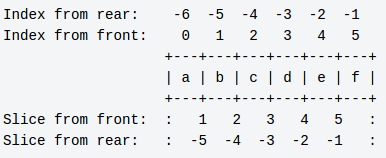

## PYTHON
https://www.tutorialspoint.com/python/python_for_loop.htm

https://www.bogotobogo.com/python/python_strings.php

Python code must always be run by an intrepreter.

When source code is exectued, python compiles it into a byte code which is a low-level platform-independent representation of the source code. IT IS NOT BINARY MACHINE CODE
- compilation is a *translation* step

Each statement of the source code is translated into byte code instructions by decomposing them into individual steps. This speeds the execution of the code. Byte code files have a .pyc extension.

> When a Python executes a program, Python reads the .py into memory, and parses it in order to get a bytecode, then goes on to execute. For each module that is imported by the program, Python first checks to see whether there is a precompiled bytecode version, in a .pyo or .pyc, that has a timestamp which corresponds to its .py file. Python uses the bytecode version if any. Otherwise, it parses the module's .py file, saves it into a .pyc file, and uses the bytecode it just created.

No compile-time phase. Python is runtime, everything happens as the program is running. 

Frozen binaries are true executables. They contain the byte code of our program along with the PVM interpreter and any Python support files our program needs and bundles them into a single package like an .exe on Windows. 

Three primary systems are capable of generating frozen binaries:

   - py2exe for Windows.
   - PyInstaller is similar to py2exe but also works on Linux and Unix.
   - freeze.

---

Can test and run code on the fly. Doesn't save the code into a file.

Namespaces

Python programs are composed of multiple module files, linked togehter by an import statement. Each module file is a self-contained package of variables, ie a namespace. One module cannot see the names defined in another module unless it explicitly imports that other file. 
- modules serve to minimize name collisions in our code. 


exec ---> similar effect to import but it doesn't import the module. 
- each time exec is called, it runs the file anew as though we had pasted it in at the place where exec is called. 
- exec does not require module reloads after file changes. it skips the normal import logic.
- exec has the potential to silently overwrite variables we may currently be using.
- for contrast, import runs the file only once per process, and it makes the file a separate module namespace so that its assignments will not change variables in our scope.

---
### Operators

variables:
- a = 10
- b = 20
  
Arithmetic Operators
Operator |	Description |	Example
---|---|---
+ Addition | Adds values on either side of the operator. |	a + b = 30
\- Subtraction |	Subtracts right hand operand from left hand operand. |	a – b = -10
\* Multiplication |	Multiplies values on either side of the operator |	a * b = 200
/ Division | 	Divides left hand operand by right hand operand |	b / a = 2
% Modulus |	Divides left hand operand by right hand operand and returns remainder |	b % a = 0
** Exponent |	Performs exponential (power) calculation on operators |	a**b =10 to the power 20
// |	Floor Division - The division of operands where the result is the quotient in which the digits after the decimal point are removed. But if one of the operands is negative, the result is floored, i.e., rounded away from zero (towards negative infinity) − |	9//2 = 4 and 9.0//2.0 = 4.0, -11//3 = -4, -11.0//3 = -4.0

Comparison Operators

Operator |	Description |	Example
---|---|---
== |	If the values of two operands are equal, then the condition becomes true. |	(a == b) is not true.
!= |	If values of two operands are not equal, then condition becomes true. |	(a != b) is true.
<> | 	If values of two operands are not equal, then condition becomes true. |	(a <> b) is true. This is similar to != operator.
\> |	If the value of left operand is greater than the value of right operand, then condition becomes true. |	(a > b) is not true.
< |	If the value of left operand is less than the value of right operand, then condition becomes true. |	(a < b) is true.
\>= |	If the value of left operand is greater than or equal to the value of right operand, then condition becomes true. |	(a >= b) is not true.
<= |	If the value of left operand is less than or equal to the value of right operand, then condition becomes true. |	(a <= b) is true.

Assignment Operators
Operator |	Description |	Example
---|---|---
= |	Assigns values from right side operands to left side operand |	c = a + b assigns value of a + b into c
+= Add AND |	It adds right operand to the left operand and assign the result to left operand |	c += a is equivalent to c = c + a
-= Subtract AND |	It subtracts right operand from the left operand and assign the result to left operand |	c -= a is equivalent to c = c - a
*= Multiply AND |	It multiplies right operand with the left operand and assign the result to left operand |	c *= a is equivalent to c = c * a
/= Divide AND |	It divides left operand with the right operand and assign the result to left operand |	c /= a is equivalent to c = c / ac /= a is equivalent to c = c / a
%= Modulus AND |	It takes modulus using two operands and assign the result to left operand |	c %= a is equivalent to c = c % a
**= Exponent AND |	Performs exponential (power) calculation on operators and assign value to the left operand |	c **= a is equivalent to c = c ** a
//= Floor Division |	It performs floor division on operators and assign value to the left operand |	c //= a is equivalent to c = c // a

Logical Operators
Operator |	Description |	Example
---|---|---
and Logical AND |	If both the operands are true then condition becomes true. |	(a and b) is true.
or Logical OR |	If any of the two operands are non-zero then condition becomes true. |	(a or b) is true.
not Logical NOT |	Used to reverse the logical state of its operand. |	Not(a and b) is false.

Membership Operators
- membership operators test for membership in a sequence, such as strings, lists, or tuples.
 
Operator |	Description |	Example
---|---|---
in | 	Evaluates to true if it finds a variable in the specified sequence and false otherwise. |	x in y, here in results in a 1 if x is a member of sequence y.
not in |	Evaluates to true if it does not finds a variable in the specified sequence and false otherwise. |	x not in y, here not in results in a 1 if x is not a member of sequence y.

Identity Operators
- compare the memory locations of two objects. 

Operator |	Description |	Example
---|---|---
is |	Evaluates to true if the variables on either side of the operator point to the same object and false otherwise. |	x is y, here is results in 1 if id(x) equals id(y).
is not |	Evaluates to false if the variables on either side of the operator point to the same object and true otherwise. |	x is not y, here is not results in 1 if id(x) is not equal to id(y).

---
Exceptions

An indication of erros. 

When an error occurs in the Python shell, it prints out some details about the exception and how it happened, which are called **unhandled exceptions**. 
- if there is no code to handle the exceptions, the program comes to a halt. 

Python functions don't declare what kind of exceptions they might raise and it's up to us to decide what possible exceptions we need to catch.

Sometimes we can anticipate what exception might occur. If we know what line of code may raise an exception, we can handle the exception use a try...except block. (like try-catch)

---

#### Object types


Everything in Python is an object.

dir function will return a list of all the attributes available for a given object. 

Common objects: 
| Object Type | Example |
---|---
Numbers | 1234, 3.1415, 3+4j, Decimal, Fraction
Strings | 'python', "Jupiter's", b'a\x01c'
Lists | [1, [2, 'three'], 4]
Dictionaries | {'Apple': 'iPhone', 'Google': 'Android'}
Tuples | {1, 'php', 3, 'Y'}
Files | myFile = open('java', 'r')
Sets | set('xyz'), {'x', 'y', 'z'}
Other core types | Booleans, types, None
Program unit types | Functions, modules, classes
Implementation related types | Compiled code, stack tracebacks

There are no type declarations in Python. The syntax of the expression determines the types of objects we create and use. 

Every value has a datatype, but we don't need to declare the datatyope of variables.

Can print objects either with full precision or in a user-friendly form. 
- Full precision = repr
- User-friendly = str

In Python 3.2, user-friendly is default(?)

Useful math modules:
```
>>> import math
>>> math.pi
3.141592653589793
>>> math.sqrt(1000)
31.622776601683793
>>> 
>>> import random
>>> random.random()
0.4245390260050892
>>> random.choice([1,2,3,4,5])
3
```

Sequence ---> Ordered collection of objects. 
- Maintain a left-to-right order
- Items are stored and fetched by their relative position

Strings support operations that assume positional ordering among items.
- len ---> get length of string
- indexing ---> grab certain characters.

```
>>> K = 'Keyboard'
>>> len(K)
8
>>> K[3]
'b'
>>> K[6]
'r'
```

Indexing backwards:
```
>>> K[-3]
'a'
>>> K[-2]
'r'
>>> K[-6]
'y'
>>> K[len(K)-2]
'r'
```

Index slicing:
- format: K[v:y] ---> give me everything in K from offset v up to but not including offest y
- this slices out (parse out) the characters in the middle. 

```
>>> K
'Keyboard'
>>> K[1:]
'eyboard'
>>> K[0:8]
'Keyboard'
>>> K[0:7]
'Keyboar'
>>> K[:7]
'Keyboar'
>>> K[:-1]
'Keyboar'
```

Every string operation produces a new string as a result.
- This is called **Immutability**

In Python, strings are immutable. Meaning they cannot be changed in-place after they are created. You can't change a string by assigning to one of its positions. Instead you can build a new string and assign it to the same name. 
- Python cleans up old objects as we go

(Immutable ---> cannot be changed)

example:
```
>>> K = 'Keyboard'
>>> K
'Keyboard'
>>> K[2]='U'
Traceback (most recent call last):
  File "<stdin>", line 1, in <module>
TypeError: 'str' object does not support item assignment
>>> K = 'U' + K[1:]
>>> K
'Ueyboard'
```

- Immutability can be used to guarantee that an object remains constant throughout our program

find ---> substring search operation

replace ---> global search and replace

example:
```
>>> K = "Keyboard"
>>> K
'Keyboard'
>>> K.find('ar')
5
>>> K
'Keyboard'
>>> K.replace('ar','zz')
'Keybozzd'
>>> K
'Keyboard'
```
- K did not change to 'Keybozzd' because strings are immutable.


other string methods:
- line ---> split a string based on a delimiter into a list of substrings
  ```
  >>> colors = 'red,white,green,blue,purple'
  >>> colors
  'red,white,green,blue,purple'
  >>> colors.split(',')
  ['red', 'white', 'green', 'blue', 'purple']
  >>> shapes = 'star;circle;square;hexagon;octagon'
  >>> shapes
  'star;circle;square;hexagon;octagon'
  >>> shapes.split(';')
  ['star', 'circle', 'square', 'hexagon', 'octagon'] 
  ``` 
- upper, lower ---> upper case and lower case conversion
  ```
  >>> K = 'Keyboard'
  >>> K.upper()
  'KEYBOARD'
  >>> K.lower()
  'keyboard'
  ```
- isalpha() ---> test for alphanumerics
- isdigit() ---> tests for digits
- rstrip() ---> removes whitespace characters

dir() will give you method names:
```
>>> dir(K)
['__add__', '__class__', '__contains__', '__delattr__', '__doc__', '__eq__', '__format__', '__ge__', '__getattribute__', '__getitem__', '__getnewargs__', '__getslice__', '__gt__', '__hash__', '__init__', '__le__', '__len__', '__lt__', '__mod__', '__mul__', '__ne__', '__new__', '__reduce__', '__reduce_ex__', '__repr__', '__rmod__', '__rmul__', '__setattr__', '__sizeof__', '__str__', '__subclasshook__', '_formatter_field_name_split', '_formatter_parser', 'capitalize', 'center', 'count', 'decode', 'encode', 'endswith', 'expandtabs', 'find', 'format', 'index', 'isalnum', 'isalpha', 'isdigit', 'islower', 'isspace', 'istitle', 'isupper', 'join', 'ljust', 'lower', 'lstrip', 'partition', 'replace', 'rfind', 'rindex', 'rjust', 'rpartition', 'rsplit', 'rstrip', 'split', 'splitlines', 'startswith', 'strip', 'swapcase', 'title', 'translate', 'upper', 'zfill']
```
- names without underscores are the callable methods on string objects. 

To get information about what the methods actually do, use the help() function:
```
>>> help(K.swapcase)
Help on built-in function swapcase:

swapcase(...)
    S.swapcase() -> string

    Return a copy of the string S with uppercase characters
    converted to lowercase and vice versa.
```

**None** is a special constant in Python.
- It is a Null value
- Also the same as False
- It is the only Null value
- Datatype = NoneType
- You can assign None to any variable, but you cannot create other NoneType objects
- Comparing None to anything other than None will always return False
- All variables whose value is None are equal to each other
- DOES NOT EQUAL 0
- NOT AN EMPTY STRING
```
>>> type(None)

>>> None == 0
False
>>> None == ''
False
>>> None == False
False
>>> None == None
True
>>> a = None
>>> a == None
True
>>> b = None
>>> a == b
True
```

---

#### Python String

Python has 2 built-in types of strings
- **str** holds bytes
- **unicode** holds Unicode characters

**Python 3.x does not have a special Unicode string/type class, meaning every string is a Unicode string**

String Literals
```
>>> # Single quotes
>>> print('P"casso')
P"casso

>>> # Double quotes
>>> print("P'casso")
P'casso

>>> # Tripple quotes
>>> print('''...Picasso...''')
...Picasso...

>>> # Escape sequences
>>> print("P\ti\nca\Osso")
P	i
ca\Osso

>>> #Raw strings
>>> print(r"C:\myscript.py")
C:\myscript.py

>>> # Byte strings
>>> print(b'Picas\x01so')
b'Picas\x01so'
>>> type(b'Picas\x01so')
<class 'bytes'>
>>> type('normal_string')
<class 'str'>

>>> # Unicode strings
>>> S = 'A\u00c4B\U000000e8C'
>>> S
'A-B-C'
>>> len(S)
5
>>> 
```

#### Escape sequences
A backslash is used to introduce an escape sequence
- \n ---> new line
- \t ---> tab 

example:
```
>>> p = 'f\nir\te'
>>> p
'f\nir\te'
>>> print(p)
f
ir	e
```

| Escape | Meaning
---|---
\\\ | Backslash (stores one \)
\\` | Single quotes (stores ')
\\" | Double quotes (stores ")
\\a | Bell
\\b | Backspace
\\f | Formfeed
\\n | Newline
\\r | Carriage return
\\t | Horizontal tab
\\v | Vertical tab
\\xhh | Character with hex value hh (at most 2 digits)
\\ooo | Character with octal value ooo (up to 3 digits)
\\0 | Null: binary 0 character (doesn't end string)
\\N{ id } | Unicode database ID
\\uhhhh | Unicode 16-bit hex
\\Uhhhhhhhh | Unicode 32-bit hex
\\other | Not an escape (keeps both \ and other)

If Python doesn't recognize the character after a backslash as an escape, Python will keep the backslash in the string.

If you have an escape and want it to be interpreted literally, ie: ```myfile = open('C:\new\text.txt', 'w')```, prefix the string with a 'r' to suppress the escape mechanism.
```>>> myfile = open(r'C:\new\text.txt', 'w')```

Alternatively, you can escape a backslash with a backslash. 

```>>> myfile = open('C:\\new\\text.txt', 'w')```

```
>>> path = r'C:\new\text.txt'
>>> path
'C:\\new\\text.txt'
>>> print(path)
C:\new\text.txt
>>> len(path)
15
```

block string ---> for coding multiline text data. enclose the string in triple quotes ("""string""")
```
>>> Daniel = """Daniel is a remarkable man with
... many different "talents" including
... talking to starfish, trees, and the sky"""
>>>
>>> Daniel
'Daniel is a remarkable man with \nmany different "talents" including\ntalking to starfish, trees, and the sky'
>>>
>>> print(Daniel)
Daniel is a remarkable man with
many different "talents" including
talking to starfish, trees, and the sky
```

Slicing with the Index
- strings are ordered collections of characters.



```
>>> S = 'Starfish'
>>> # Index from the start and end
... S[0], S[-1], S[-4]
('S', 'h', 'f')
>>> # Extracting a section by slicing
... S[1:3], S[3:], S[-6]
('ta', 'rfish', 'a')
>>> S[1:3], S[3:], S[-6], S[:-5]
('ta', 'rfish', 'a', 'Sta')
```

Slice expressions have an option 3rd index as a step or stride.
```x[d:e:f]```. This means: extract all items in x from offset d through e-1 by f.

```
>>> F = 'Fantastic Frank'
>>> F
'Fantastic Frank'
>>> F[1:11:3] #start at index 1 and extract every 3rd character up to 11-1
'aaiF'
>>> F[1:11:2] #start at index 1 and extract every 2rd character up to 11-1
'atsi '
>>> F[::-1] # -1 indicates to go from left to right. It reverses the sequence.
'knarF citsatnaF'
>>> F[11:1:-1]
'rF citsatn'
```
---

## OS Module

os module contains functions to get info on local dirs, files, processes, and environment variables

- os.getcwd() ---> get current working directory
  ```
  >>> import os
  >>> print(os.getcwd())
  C:\Python32
  >>> os.chdir('/test')
  >>> print(os.getcwd())
  C:\test
  ```
- os.chdir() ---> function to change the current working directory (cwd)
- os.path ---> function to manipulate filenames and directory names
  - os.path.join ---> function constructs a pathname out of one or more partial pathnames. Concatenates strings.
  - os.path.expanduser() ---> function will expand a pathname that uses ~ to represent the users' home dir.
  ```
  >>> import os
  >>> print(os.path.join('/test/', 'myfile'))
  /test/myfile
  >>> print(os.path.expanduser('~'))
  C:\Users\K
  >>> print(os.path.join(os.path.expanduser('~'),'dir', 'subdir', 'k.py'))
  C:\Users\K\dir\subdir\k.py
  ```
- os path.split ---> splits full pathnames, dir names, and filenames into their constituent parts.
  ```
  >>> pathname = "/Users/K/dir/subdir/k.py"
  >>> os.path.split(pathname)
  ('/Users/K/dir/subdir', 'k.py')
  >>> (dirname, filename) = os.path.split(pathname)
  >>> dirname
  '/Users/K/dir/subdir'
  >>> pathname
  '/Users/K/dir/subdir/k.py'
  >>> filename
  'k.py'
  >>> (shortname, extension) = os.path.splitext(filename)
  >>> shortname
  'k'
  >>> extension
  '.py'
  ```
- glob.glob() ---> function to get the contents of a directory programmatically.
  ```
  >>> import glob
  >>> os.chdir('../')
  >>> glob.glob('*.md')
  ['puppet.md', 'RHCSA.md', 'nix.md', 'README.md', 'salonzed.md', 'Basic AWS VPC.md', 'docker.md', 'bash.md']
   ```

Opening a file
- use built in open() function

``` myfile = open('mydir/file.txt', 'w') ```
- w is the processing mode. in this case w means to open or create a file for writing and if the file exists, overwrite it.

Processing modes:

|Mode |	Description
---|---
r |	Opens a file for reading only. The file pointer is placed at the beginning of the file. This is the default mode.
rb |	Opens a file for reading only in binary format. The file pointer is placed at the beginning of the file. This is the default mode.
r+ |	Opens a file for both reading and writing. The file pointer will be at the beginning of the file.
rb+ |	Opens a file for both reading and writing in binary format. The file pointer will be at the beginning of the file.
w |	Opens a file for writing only. Overwrites the file if the file exists. If the file does not exist, creates a new file for writing.
wb |	Opens a file for writing only in binary format. Overwrites the file if the file exists. If the file does not exist, creates a new file for writing.
w+ |	Opens a file for both writing and reading. Overwrites the existing file if the file exists. If the file does not exist, creates a new file for reading and writing.
a |	Opens a file for appending. The file pointer is at the end of the file if the file exists. That is, the file is in the append mode. If the file does not exist, it creates a new file for writing.
ab |	Opens a file for appending in binary format. The file pointer is at the end of the file if the file exists. That is, the file is in the append mode. If the file does not exist, it creates a new file for writing.
a+ |	Opens a file for both appending and reading. The file pointer is at the end of the file if the file exists. The file opens in the append mode. If the file does not exist, it creates a new file for reading and writing.
ab+ |	Opens a file for both appending and reading in binary format. The file pointer is at the end of the file if the file exists. The file opens in the append mode. If the file does not exist, it creates a new file for reading and writing.
----

## Decision Making

- Any non-zero and non-null values are TRUE
- Any zero or null valyes are FALSE

if statements -- 
```
#!/usr/bin/env python3

var1 = 100
if var1:
   print "1 - Got a true expression value"
   print var1

var2 = 0
if var2:
   print "2 - Got a true expression value"
   print var2
print "Good bye!"
```

Statements are executed sequentially. First statement is executed first, followed by second, and so on. You may need to execute a block of code serveral times.

A loop lets us execute a state or group of statements multiple times. 

Loop type | Description
---|---
while loop | repeats a statement or group of statements while a given condition is **TRUE**. It tests the condition before executing the loop body.
for loop | executes a sequence of statements multiple times and abbreviates the code that manges the loop variable
nested loops | A loop inside a loop

- while loops
    - repeatedly executes a statement as long as a given condition is true.

    ```
    while expression:
        statement(s)
    ```
    another example:
    while01.py
    ```
    #!/usr/bin/env python3
    count = 0
    while (count < 9):
        print 'The count is:', count
        count = count + 1
    print "Good bye"
    ```
    ```
    $ python while01.py
    The count is: 0
    The count is: 1
    The count is: 2
    The count is: 3
    The count is: 4
    The count is: 5
    The count is: 6
    The count is: 7
    The count is: 8
    Good bye
    ```
    
    Infinite loop ---> A loop becomes infinte if a condition never becomes FALSE. The loop will never end.

    **else** statements
    - if an **else** statement is used with a for loop; the else statement is executed when the loop has exhausted iterating the list
    - if an **else** statement is used with a while loop; the else statement is executed when the condition becomes false

    while02.py
    ```
    #!/usr/bin/env python3
    count = 0
    while count < 5:
       print count, " is  less than 5"
       count = count + 1
    else:
       print count, " is not less than 5"
   ```
   ```
   $ python while02.py
   0 is less than 5
   1 is less than 5
   2 is less than 5
   3 is less than 5
   4 is less than 5
   5 is not less than 5
   ```

- for loops
    - iterate over the items of any sequence, such as a list or a string
```
for iterating_var in sequence:
   statements(s)
```
for01.py
```
#!/usr/bin/env python3
for letter in 'Daniel':     # First Example
   print 'Current Letter :', letter

colors = ['red', 'green',  'purple', 'pink']
for color in colors:        # Second Example
   print 'Current color :', color
```
```
$ python for01.py
Current Letter : D
Current Letter : a
Current Letter : n
Current Letter : i
Current Letter : e
Current Letter : l
Current color : red
Current color : green
Current color : purple
Current color : pink
```

---

## Pratice

#### Merge two sorted lists

You have two sorted lists, and you need to write a function to merge the two lists into one sorted list:
```
a = [3, 4, 6, 10, 11, 18]
b = [1, 5, 7, 12, 13, 19, 21]
```

the code:

```
a = [3, 4, 6, 10, 11, 18]
b = [1, 5, 7, 12, 13, 19, 21]
c = []

while a and b:
    if a[0] < b[0]:
        c.append(a.pop(0))
    else:
        c.append(b.pop(0))